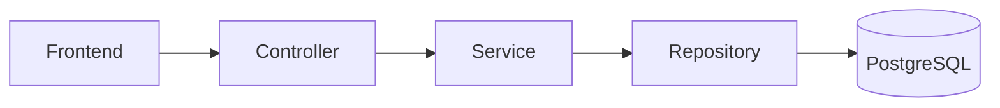

# MIRA Repository Constitution

These rules govern the repository. Version-specific requirements belong in that version's Spec Kit.

1. Each version follows SDD and Spec Kit order: constitution, specification, plan, research, data model, contracts, quickstart, tasks, implementation, validation.
2. The specification is the source of truth. Apply YAGNI and do not implement future versions early.
3. The stack is C#, ASP.NET Core Web API, PostgreSQL, explicit parameterized SQL, Swagger/OpenAPI, Docker and Docker Compose.
4. The architecture is Frontend -> Controller -> Service -> Repository -> PostgreSQL.
5. Repository is the only layer authorized to open database connections, execute SQL and map persistence results.
6. Controllers handle HTTP and services handle business rules; services never execute SQL or return IActionResult.
7. Use dependency inversion, small interfaces and SOLID; register abstractions through dependency injection.
8. The supplied database model is authoritative. Do not invent tables, columns, relationships or requirements.
9. DELETE HTTP means logical deletion through the model's active-state column. Do not physically delete V1 catalog records.
10. Secrets must come from environment variables. Never commit real passwords or `.env`; maintain `.env.example`.
11. The local environment must use documented non-conflicting ports: API `8080`, frontend `5173`, PostgreSQL host `5544`.
12. Every endpoint must exist in the version contracts, and every functional version must provide a coherent frontend representation.

